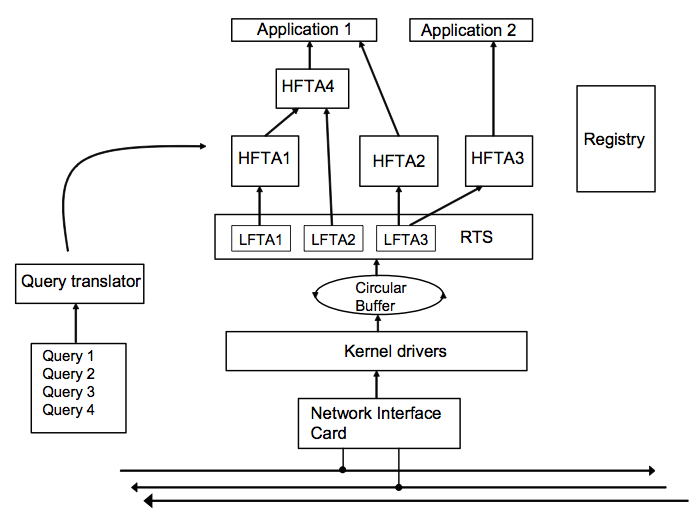

.. :author: Cask Data, Inc.
   :description: Concepts and architecture
   :copyright: Copyright © 2014 Cask Data, Inc.

============================================
Tigon Concepts and Architecture
============================================

Tigon Concepts
============================================

TigonSQL Architecture
============================================

Architecture of a High-performance Data Stream Management System
----------------------------------------------------------------

Designing a high-performance Data Stream Management System (DSMS) requires solving a large
number of unique technical challenges stemming from extreme data rates and real-time
processing requirements. In this document, we present the architecture of the Tigon stream
database specifically designed to address these challenges. Tigon was developed by AT&T
Labs-Research and Cask Data, Inc. for monitoring high-rate network data streams and is
currently used as a vehicle for networking and streaming research by AT&T.

Even though the system is specialized for network monitoring applications, most of the
Tigon design principles apply to any streaming application required to process high-rate
data streams in real-time. This document focuses on these more general aspects of the
system.

The document is organized as:

- An overview of the `stream query language`_ used by Tigon and a description of the main types 
  of streaming queries;
- An overview of the `two-level (low- and high-) architecture <#two-level-query-architecture>`_ 
  that Tigon uses for early data reduction;
- The `main software components <#system-architecture>`_ of the system;
- `Query optimizations <#query-optimization>`_ performed by Tigon to handle the demands of
  real-time stream processing; and a
- `Summary <#doc-summary>`_ of concepts.

Stream Query Language 
---------------------

The Tigon query language, *TigonSQL*, is a pure stream query language with a SQL-like
syntax (being mostly a restriction of SQL). That is, all inputs to a TigonSQL are streams, and
the output is a data stream. This restriction enables easy query composition and greatly
simplifies and streamlines the implementation of efficient streaming operators. The query
model used by most of the recently proposed stream database systems is that of a
continuous query over a sliding window of the data stream. While this model has some
advantages (e.g., presentation of results to the end user) and some areas of best
application (e.g., sensor networks), it is poorly suited for processing high-rate feeds
such as network data streams, as it suffers from poor performance and is cumbersome for
expressing typical network analysis queries. 

One of the main problems is the complexity of the continuous query model, making it very
difficult to implement efficient streaming operators capable of processing the data at
line speeds. Query composition is also complicated by complex stream-to-relation and
relation-to-stream transformations happening behind the scene. The input to a query is one
or more data streams, but the output is a (continuously changing) relation. Queries can
still be composed (i.e., can use the output as its input), but the differences in the
output must often be reverse interpreted as a data stream.

A second problem is the difficulty of precisely expressing a query—or conversely, understanding
what a query means. Consider this example query that uses CQL (continuous query language)
syntax::

  (Select Count(*) From C, B
     Where C.src=B.src and C.dest=B.dest and C.id=B.id)
  / (Select Count(*) from B)
  
This query is intended to identify the fraction of traffic in the backbone B which can be
attributed to a customer network C. However, the semantics of the result are not clear.
Since the output is used for monitoring, the intended result is not likely to be the
evaluation of the query over the entire stream; rather, over some recent window. 

However, the window is not specified, and there are in fact three windows to specify (two
in the first subquery, one in the second). The snapshots taken by these three subqueries
must be precisely synchronized (but on what, is not specified), else the result is erratic
and meaningless. If the respective windows are defined by a number of tuples rather than
by time, the three windows will certainly be unsynchronized. Although the example query
appears to be simple, an examination of the evaluation details shows that the semantics
are complex.

A primary requirement of a DSMS is to provide a way to unblock otherwise blocking
operators such as aggregation and join. In Tigon, unblocking is generally accomplished by
defining a window on the data stream on which the query evaluation will occur at any
moment in time. Tigon uses tumbling windows, which are more suitable for network analysis
applications.

Unblocking is accomplished by limiting the scope of output tuples that an input tuple can
affect using a timestamp mechanism. To implement this mechanism, Tigon requires that some
fields of the input data streams be identified as behaving like timestamps. The locality
of input tuples is determined by analyzing how the query references the timestamp fields.
In the following sections we describe all the basic types of streaming queries in
TigonSQL, paying particular attention to how the timestamp analysis is used to unblock
normally blocking queries. All the example queries examples assume the following schema::

  PKT(time_increasing, srcIP, destIP, len)

The time attribute is marked as being ordered, specifically increasing.

Aggregation Queries
...................
In an aggregation query, at least one of the *group-by* attributes must have a
timestampness, say monotone increasing. When this attribute changes in value, all existing
groups and their aggregates are flushed to the operator’s output (similar to the tumble
operator). The values of the group-by attributes with timestampness thus define epochs in
which aggregation occurs, with a flush at the end of each epoch. Consider this TigonSQL query::

  SELECT tb, srcIP, destIP, count(*)
  FROM TCP
  GROUP BY time/60 as tb, srcIP, destIP
  
Since time is monotone increasing, the *tb* group-by variable is inferred to be monotone
increasing also. This query counts the packets between each source and destination IP
address during 60 second epochs. 

In addition to supporting all standard SQL aggregate functions such as SUM, COUNT, MIN,
etc, Tigon supports User Defined Aggregate Functions (UDAFs). In order to incorporate a
new UDAF into Tigon, the user needs to provide the following four functions: 

- an INITIALIZE function, which initializes the state of a scratchpad space;
- an ITERATE function, which adds a value to the state of the UDAF; 
- an OUTPUT function, which returns the value of the aggregate; and 
- a DESTROY function, which releases UDAF resources. 

Tigon handles all the details of managing the scratchpad space for maintaining the state
of aggregates and automatically inserts the calls to corresponding functions.

Running Aggregates 
...................
Standard aggregate queries described in the previous section suffer from a drawback—the
state of the aggregates lives only for one epoch. This restriction makes it difficult to
compute the aggregates that require variable size windows such as moving averages.
Consider a streaming query that for every minute and every TCP connection reports the
number of duplicate sequence numbers. A TigonSQL statement for the query is::

 SELECT tb, srcIP, dstIP, sum_of_dups(seq) 
 FROM TCP
 GROUP BY time/60 as tb, srcIP, dstIP 
  
Since some of the TCP connection spans multiple one minute epochs, the query undercounts
all such connections. Tigon solves this problem by introducing a special type of
aggregation query—running aggregation—which allows a running aggregate to retain its state
between the epochs. This is accomplished by introducing a new TigonSQL keyword –
*Closing_When*. 

Whenever a predicate given in Closing_When clause evaluates to TRUE, the state of the
aggregate is discarded from the query’s memory. In the example above, the proper condition
for closing the aggregate is whenever the termination of the TCP connection is detected
(e.g. a FYN packet received). A fixed TigonSQL statement that properly counts the number
of duplicate sequence numbers, using the running aggregate sum_of_dups, is::

  SELECT tb, srcIP, dstIP, sum_of_dups(seq) 
  FROM TCP
  GROUP BY time/60 as tb, srcIP, dstIP
  CLOSING_WHEN Or_aggr(FYN) = TRUE or count(*) = 0 

Using running aggregate functionality, it becomes possible to express sliding windows
queries such as moving averages in TigonSQL. Similar approaches of expressing sliding
windows queries using more efficient tumbling windows have been used by others using
pane-based aggregate evaluation.

Stream Merge and Join Queries
.............................

The merge operator allows us to combine streams from multiple sources into a single
stream. The operator is particularly important for applications that need to monitor a
number of streams that share the same schema. For example, network monitoring applications
frequently need to monitor a number of network links as one logical link.

A merge operator performs a union of two streams *R* and *S* in a way that preserves
timestamps. *R* and *S* must have the same schema, and both must have a timestamp field, say
t, on which to merge. If tuples on one stream, say *R*, have a larger value of t than those
in *S*, then the tuples from *R* are buffered until the *S* tuples catch up. For example, the
query below merges two TCP streams coming from two separate network interfaces into one
logical stream::

  MERGE R.timestamp : S.timestamp
  FROM interface1.TCP R, interface2.TCP S 
  
Similarly, a join query on streams *R* and *S* must contain a join predicate such as
``R.tr=S.ts`` or ``R.tr/2=S.ts+1``; that is, one that relates a timestamp field from *R*
to one in *S*. The input streams are buffered (in a manner similar to that for a merge) to
ensure that the streams match up on the timestamp predicate. An example of a join query
that combines the length of packets with matching IP addresses is::

  SELECT time, PKT1.srcIP, PKT1.destIP,PKT1.len + PKT2.len
  FROM PKT1 JOIN PKT2 
  WHERE PKT1.time = PKT2.time and PKT1.srcIP = PKT2.srcIP 
    and PKT1.destIP = PKT2.destIP 
    
Even though Tigon currently does not support sliding windows joins, it is fairly
straigtforward to extend TigonSQL and the query translator to support this type of
streaming queries.

Two-Level Query Architecture
----------------------------

Tigon has a *two-level query architecture*, where the *low* level is used for data
reduction and the *high* level performs more complex processing. This approach is employed
to keep up with high streaming rates in a controlled way. 

High-speed data streams are called source streams to distinguish them from data streams
created by queries. The data volumes of these source streams are far too large to provide
a copy to each query on the stream. Instead, the queries are shipped to the streams. 

If a query Q is to be executed over source stream S, then Tigon creates a subquery q which
directly accesses S, and transforms Q into  Q\ :sub:`0` which is executed over the output
from q. In general, one subquery is created for every table variable which aliases a
source stream for every query in the current query set. The subqueries read directly from
the ring buffer. 

Since their output streams are much smaller than the source stream, the two-level
architecture greatly reduces the amount of copying: simple queries can be evaluated
directly on a source stream.

The subqueries (which are called *LFTAs*, or low-level queries, in Tigon)
are intended to be fast, lightweight data reduction queries. By deferring expensive
processing (expensive functions and predicates, joins, large scale aggregation), the high
volume source stream is quickly processed, minimizing buffer requirements. The expensive
processing is performed on the output of the low level queries, but this data volume is
smaller and easily buffered.

In general, the most appropriate strategy depends on the streaming rate as well as the
available processing resources. Choosing the best strategy is a complex query optimization
problem that attempts to maximize the amount of data reduction without overburdening the
low-level processor and thus causing packet drops. We will give a more detailed
description of the query splitting optimizations `below
<#splitting-selection-and-aggregation-queries>`__. 

The Tigon DSMS has many aspects of a real-time system: for example, if the system cannot
keep up with the offered load, it will drop tuples. To spread out the processing load over
time and thus improve schedulability, Tigon implements traffic shaping policies in some of
its operators. In particular, the aggregation operator uses a slow flush to emit tuples
when the aggregation epoch changes. One output tuple is emitted for every input tuple
which arrives, until all finished groups have been output (or the epoch changes again, in
which case all old groups are flushed immediately).

System Architecture
-----------------------

The Tigon system consists of a four main software components: query translator,
runtime system, cluster manager, and applications:

- **Query translator** translates TigonSQL queries submitted to the system into multiple
  executable query modules called FTAs, which stands for *Filtering,* *Transformation,* and
  *Aggregation.*

  First, all submitted queries are automatically split into lightweight low-level queries
  performing simple selection and aggregations (LFTAs) and complex high-level queries
  performing more complex aggregations, merges and joins (HFTAs). After performing the
  split, the queries are translated into C/C++ code which is then translated into native
  machine code. 

  All the HFTAs run as separate processes using a standard stream library to communicate
  with other FTAs and applications. All the LFTA modules are linked directly into the
  runtime system for efficient access to the source streams. A query translator is capable
  of generating both centralized and distributed query plans depending on particular Tigon
  configuration. If a streaming query spans multiple network interfaces or several
  distributed data streams, the generated code is automatically parallelized to use the
  available resources.

- **Runtime system** provides the entire infrastructure necessary for running the FTA on
  the network streams coming from one of the managed interfaces. It provides such services
  as management and tracking of the data sources, maintaining the registry of all active
  FTAs, and handling Inter-Process Communications (IPC). Additionally, the runtime system
  is responsible for the scheduling and execution of all the low-level queries linked
  directly into it. Each Tigon node in distributed configurations runs its own runtime
  system responsible for the local FTAs.

- **Cluster manager** component is responsible for managing a network of cooperating Tigon
  nodes. This component is responsible for all aspects of distributed stream processing:
  placement of the FTAs on participating hosts, failure detection for applications and
  streaming queries, restart-based recovery, load shedding during overload conditions, and
  performance monitoring. In addition, a cluster manager is responsible for providing a
  distributed FTA registry service for remote nodes.

- **Applications** are the main consumers of the output produced by the streaming queries.
  From the system’s perspective, there is little difference between the applications and
  HFTA modules. Both run as separate processes and can subscribe to and consume the output
  streams produced by other FTAs using a standard stream library. The only difference lies
  in that an application does not produce an output stream of its own and essentially acts
  as a data sink. Many Tigon applications dump the processed streaming data into a data
  warehouse for further offline analysis.
  
Here is a simplified architecture of a single-node Tigon system:

Query Optimization
------------------
Effective query optimization mechanism is critical for a Data Stream Management System
that needs to perform sophisticated query processing at line speeds. Tigon uses a large
number of optimizations to lower the processing cost for both HFTA and LFTA queries. The
range of techniques employed includes conventional optimizations based on relational
algebra (pushing selection and projection as low as possible, join reordering) and a
number of unique streaming query optimizations. In the following subsections we give an
overview of streaming-specific Tigon.

Splitting Selection and Aggregation Queries
...........................................
In `the architecture section <two-level-query-architecture>`__, we discussed that
optimally splitting streaming queries is a complex optimization problem. Intuitively we
would like to maximize the amount of data reduction performed by low-level queries (by
pushing more processing to LFTAs), while keeping per-tuple processing costs very low to
avoid overburdening the runtime systems and causing an uncontrollable packet drop. 

The solution used in Tigon relies on a simple cost model to compare the respective costs
of different selection predicates and scalar expressions involving the attributes of the
data stream. Only the predicates and functions deemed inexpensive enough to run on
low-level (called LFTA-safe predicates and functions) are pushed down for execution in an
LFTA.

LFTA-safeness largely depends on the restrictions or additional capabilities of the
runtime system used in particular Tigon configuration.

We will illustrate how query splitting works using a network monitoring query that
extracts the names of the hosts from HTTP requests. The TigonSQL statement for this
selection query is::

  SELECT tb*60, destIP, dest_port, 
    str_extract_regex(TCP_data, `[Hh][Oo][Ss][Tt]:[0-9A-Z\\.: ]*’)
    as hostheader
  FROM TCP
  WHERE ipversion=4 and offset=0 and protocol=6 and 
    str_match_start[TCP_data, ‘GET’]
    
The query selects only TCP packets that starts with “GET” (using the ``str_match_start()``
function) and extracts the name of HTTP hostnames using ``str_extract_regex()``. For the
runtime system, ``str_extract_regex()`` is prohibitively expensive and thus
it is move into a high-level subquery. The results of automatic query decomposition for
the query are:

Query **hostnames_low**::

  SELECT tb*60 as t, destIP, dest_port, TCP_data
  FROM TCP
  WHERE ipversion=4 and offset=0 and protocol=6 

Query **hostnames_high**::

  SELECT t, destIP, dest_port, 
    str_extract_regex(TCP_data, `[Hh][Oo][Ss][Tt]:[0-9A-Z\\.: ]*’)
    as hostheader
  FROM hostnames_low
  WHERE str_match_start[TCP_data, ‘GET’]

Splitting aggregation queries is done similarly; however there are additional
considerations related to the way that aggregation is implemented at LFTA level. To
ensure that aggregation is fast, the low-level aggregation operator uses a fixed-size
hash table for maintaining the different groups of a GROUP BY. If a hash table collision
occurs, the existing group and its aggregate are ejected (as a tuple), and the new group
uses the old group's slot. That is, Tigon computes a partial aggregate at the low level
which is completed at a higher level. The query decomposition of an aggregate query Q is
similar to that of sub-aggregates and super-aggregates in data cube computations. If the
definition of one or more grouping variables uses an LFTA-unsafe function, it is not
possible to decompose the aggregation query into sub- and super-aggregates. Instead, the
low-level query will be restricted to performing selection using LFTA-safe predicates
from the original query.

We'll demonstrate aggregate query decomposition using a networking query that tracks how
many requests people send to different HTTP hosts. The query is similar to the previously
shown selection query, except that now the data is aggregated using the extracted hostname
as a key. 

Since the aggregation key (hostname) is computed using an LFTA-unsafe function, the
query will be split into a low-level selection and a high-level aggregation query. The
final query decomposition is shown in this diagram: 

.. figure:: _images/aggregate-query-decomposition.png
   :width: 6in
   :align: center

   Aggregate Query Decomposition 

Prefilters 
.............

A Data Stream Management System is expected to handle a very large number of queries
running on the same sets of input streams, which greatly increases the likelihood of
significant overlap between the computations performed by different queries. In order to
avoid performing redundant computations, Tigon utilizes a prefilter mechanism which
extracts the shared predicates out of streaming queries and executes them only once per
input tuple. In order to keep the prefilter very lightweight and to avoid pushing
expensive predicates that may not be invoked by LFTAs, only cheap predicates are selected
for the inclusion in the prefilter. Non-shared predicates are also considered since
pushing them into prefilter allows the Tigon to avoid relatively expensive LFTA
invocations. 

The query translator selects the candidate predicates based on the query analysis and
generates a special prefilter bit-vector with one bit assigned to each selected predicate.
All the predicates selected for inclusion in the prefilter are removed from their
corresponding queries. Additionally, for every LFTA query, a signature bit-vector is
computed denoting which of the prefilter predicates it contains. Whenever an input tuple
enters the system, it is passed to the prefilter, which evaluates the selected predicates
and sets the corresponding bits of the prefilter bit-vector. The resulting bit-vector is
then compared with the signature of each LFTA to figure out whether the tuples should be
passed for further processing by that LFTA.

Machine Code Generation
.......................
Interpreting a streaming query at runtime incurs a significant CPU overhead that should be
avoided if real-time tuples processing is required. To avoid this overhead, Tigon instead
uses a generated code system. All the input queries are translated into C (for LFTAs) and
C++ (for HFTAs) code which is then translated into native machine code. The object modules
corresponding to the low-level queries are linked directly into the runtime system.

Having multiple LFTA in the same address space removes a lot of synchronization overhead
when accessing the ring buffer and leads to good cache locality, critical for low-level
queries. The obvious drawback of this implementation is the loss of flexibility—it is
not possible to add new LFTAs on the fly. However, the performance benefits combined with
the ability to adapt existing LFTAs using a parameter-mechanism makes it a good choice for
real-time stream processing. 

An interesting aspect of the query translator is its template-based generation of HFTA
code. All the high-level streaming operators are implemented as general C++ template
classes encapsulating the general functionality of an operator. The query translator
specializes the templates by generating a special functor class specific to a particular
query. For example, the template for an aggregation operator implements all the generic
functionality required by this type of query: maintaining a group table, updating the
values of the aggregates, flushing the aggregate values of the epoch change, etc. The
generated aggregate functor only needs to implement query-specific functionality such as
extracting all referenced tuple attributes and generating output tuples based on grouping
variables and computed aggregates. The Tigon approach to template-based code generation
combines the performance of generated query system with the ease of extensibility and
modification to existing operators.

.. _doc-summary:

Summary
-------
In this document, we presented the design of Tigon—a high-performance database for
network applications. We presented an overview the stream query language
used by Tigon and described the semantics of the basic types of streaming queries. We also
surveyed the two-level architecture for early data reduction and describe several of the
streaming query optimizations that Tigon uses for efficient processing of high-rate
streams.

Where to Go Next
================

Now that you're familiar with the basic concept and architecture of Tigon, take a look at:

- `Developer <developer.html>`__, which covers writing applications using Tigon.

