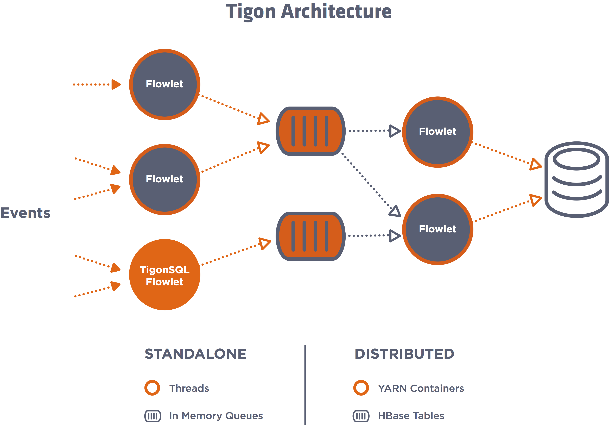
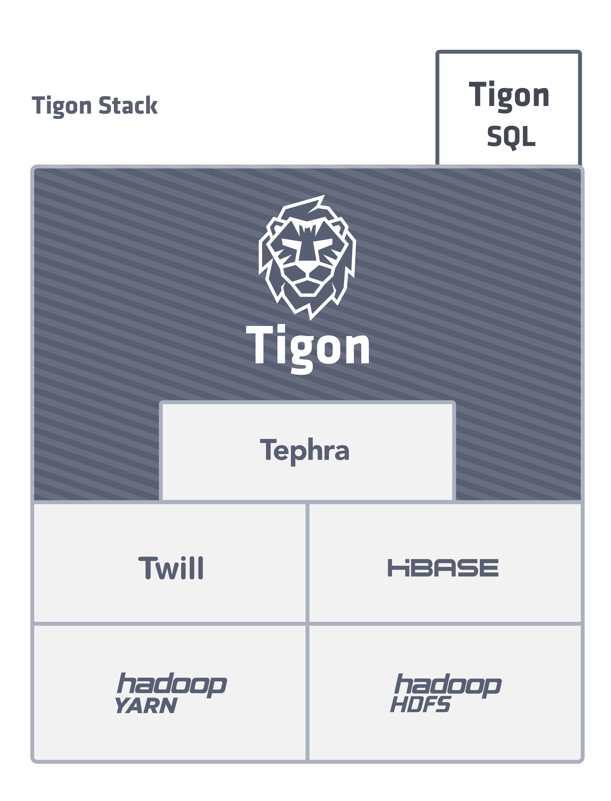

.. :author: Cask Data, Inc.
   :description: Concepts and architecture
   :copyright: Copyright © 2014 Cask Data, Inc.

============================================
Tigon Concepts and Architecture
============================================

Tigon Architecture
==================

Tigon is a real-time, low-latency, high-throughput stream processing framework built on
top of Apache Hadoop, YARN and HBase.

Applications built using the Tigon platform are referred to as Flows. Each Flow contains one or
more Flowlets which can be connected together and be visualized as a Directed Acyclic
Graph:

The data flow between Flowlets is implemented through Queues. These flows can be run in
either in Standalone Mode (for example, on a laptop) or in a Distributed Mode (in a Hadoop
cluster). 

In Standalone Mode, the Flowlets are implemented using threads, and Queues are implemented
using in-memory data structures. 

In Distributed Mode, each Flowlet is a YARN container, and Queues are implemented using
HBase Tables. An application can, if required, persist data to HBase.
Since multiple Flowlets can potentially be accessing the same Tables, it's advised that an
application use Cask Tephra to write to the HBase Tables transactionally. (Details of this
are covered in our Developer Guide section on the `"Flow Transaction System". 
<developer.html#flow-transaction-system>`__)

Tigon Stack
===========

TigonSQL is a library built for Tigon. It contains a in-memory Stream processing engine
that can perform filtering, aggregation, and joins of data streams. It is built to be a
special flowlet (``AbstractInputFlowlet``) which can be used as a part of your Flow. 

Ideally, to use TigonSQL’s ``AbstractInputFlowlet`` in your application, it should be the
first flowlet in your Flow. It will be used to ingest high-throughputs of multiple data
streams and process them in-memory, and the outputs will then be persisted in Queues
(HBase Tables, in Distributed Mode) for subsequent flowlets to process. 

Currently the number of instances of an ``AbstractInputFlowlet`` is limited to one. Other
flowlets don’t have this constraint. ``AbstractInputFlowlet`` exposes HTTP and TCP
endpoints for the user to ingest data. Details on how to use these endpoints is covered in
our `Developer Guide. <developer.html#ingesting>`__

Where to Go Next
================

Now that you're familiar with the basic concept and architecture of Tigon, take a look at:

- `Developer <developer.html>`__, which covers writing applications using Tigon.
